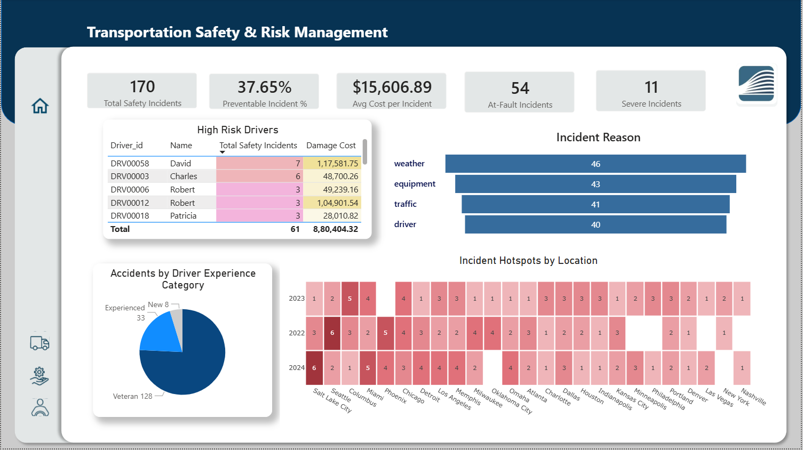

Supply Chain Analytics: Logistics, Fleet & Risk Performance

📌 Project Overview

This project delivers an enterprise-grade Supply Chain Analytics solution focused on logistics operations, fleet utilization, facility efficiency, and transportation risk management.Using Power BI and DAX, the dashboards provide executive visibility into profitability, operational bottlenecks, utilization, service levels, and safety risk.

🎯 Business Objectives

Track logistics revenue, margin, and cost-to-serve

Identify underperforming routes, customers, and facilities

Improve fleet utilization and delivery performance

Monitor safety incidents and operational risk exposure

🛠️ Tools & Technologies

Power BI

DAX (KPIs, Measures, Time Intelligence)

Star Schema Data Modeling

Interactive BI Visuals (Maps, Decomposition, Drill-through)
***
📊 Executive Overview

High-level snapshot of overall supply chain performance and financial health.

Key Insights:

Revenue, profit, and margin trends by quarter

Profit contribution by freight type and customer

YoY growth and operational performance indicators

🏭 Logistics Operations & Facility Efficiency

Analysis of detention, facility performance, and route-level profitability.

Key Insights:

Detention hours by facility and customer

Impact of detention on utilization and cost

Gross margin vs load volume by route

Identification of inefficient facilities

🚛 Fleet & Driver Performance

Fleet utilization, maintenance, and driver efficiency analysis.

Key Insights:

On-time pickup and delivery performance

Maintenance type distribution and downtime impact

Driver productivity (trips vs miles)

Fuel efficiency (average MPG) by driver

⚠️ Transportation Safety & Risk Management

Risk monitoring and safety performance analysis across drivers and locations.

Key Insights:

Total and preventable safety incidents

High-risk drivers and cost impact

Incident reasons (weather, traffic, equipment, driver)

Accident hotspots by location and time

***
🧱 Data Model & Architecture

Designed a star-schema data model integrating:

Shipments & logistics data

Fleet & vehicle utilization

Maintenance & downtime records

Safety incidents & risk data

Optimized for scalable KPIs and time-intelligence analysis

Enabled cross-functional analysis across route, customer, facility, and driver
***

🔒 Data Availability & Privacy

Due to data size and confidentiality constraints, the complete dataset is not included in this repository.

A representative sample dataset is provided to demonstrate:

Data modeling approach

KPI logic and DAX calculations

Analytical structure and business reasoning

This follows enterprise data governance best practices.

***

👤 Author

G S L Maha
🔗 LinkedIn: https://www.linkedin.com/in/gslmaha
